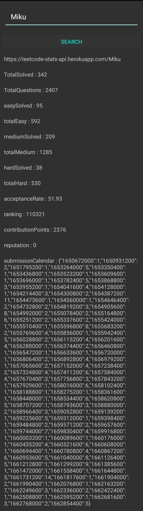
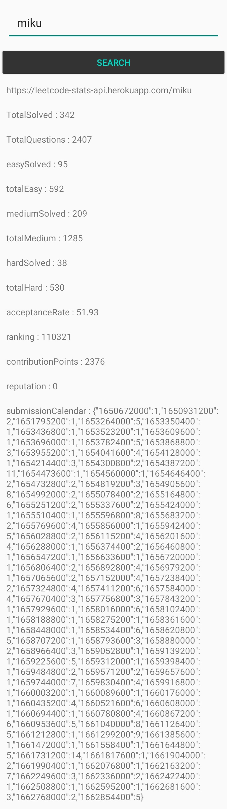

This app fetches Leetcode statistics and and shows .  
I am working on making widgets for this data , which will be placed on homescreen.

<table>
  <tr>
    <td>
       
    </td>
    <td>
      
    </td>
  </tr>
 </table>

 **Setup**  
 Download the code and let Android studio do it's work.